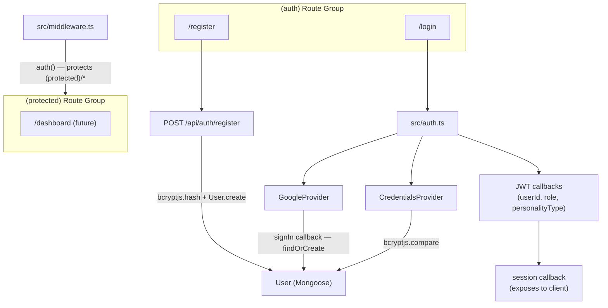

# Auth.js v5 Authentication Plan

## Package Status

`next-auth` v5.0.0-beta.30 is **already installed** in `node_modules` — no separate "Auth.js" install is needed. Auth.js v5 and `next-auth` v5 are the same package. However, beta.30 is outdated; the first step will upgrade it to the latest stable v5 release.

```bash
npm install next-auth@latest
```

## Architecture



## Key Design Decisions

- **No adapter** — use JWT strategy with custom `signIn`, `jwt`, and `session` callbacks to bridge Auth.js with the existing Mongoose `User` model
- **Auth.js v5 env vars** — uses `AUTH_SECRET`, `AUTH_GOOGLE_ID`, `AUTH_GOOGLE_SECRET` (not `NEXTAUTH_*`)
- **Password hashing** — add a `pre('save')` hook on the User model using `bcryptjs` (already installed)
- **Google → User mapping** — in `signIn` callback: find user by email, if not found create a `registered` user from Google profile data
- **`googleId` field** — add to User schema to identify Google-linked accounts and skip password requirement

## Files to Create

### 1. [`src/auth.ts`](src/auth.ts) — Auth.js core config

```typescript
import NextAuth from 'next-auth';
import Credentials from 'next-auth/providers/credentials';
import Google from 'next-auth/providers/google';
// Credentials: find user by email, bcryptjs.compare password
// Google: handled in signIn callback (findOrCreate by email)
// jwt callback: embed { id, role, personalityType } into token
// session callback: forward token fields to session.user
```

### 2. [`src/app/api/auth/[...nextauth]/route.ts`](src/app/api/auth/%5B...nextauth%5D/route.ts) — handler

```typescript
import { handlers } from '@/auth';
export const { GET, POST } = handlers;
```

### 3. [`src/app/api/auth/register/route.ts`](src/app/api/auth/register/route.ts) — registration endpoint

Validates with Zod, hashes password via `bcryptjs.hash`, creates a `registered` User.

### 4. [`src/middleware.ts`](src/middleware.ts) — route protection

```typescript
import { auth } from '@/auth';
export default auth;
export const config = { matcher: ['/(protected)/(.*)'] };
```

### 5. [`src/app/(auth)/layout.tsx`](src/app/%28auth%29/layout.tsx) — centered auth layout

### 6. [`src/app/(auth)/login/page.tsx`](src/app/%28auth%29/login/page.tsx) + `LoginForm.tsx`

- Server page wrapping a `'use client'` form
- React Hook Form + Zod validation
- Calls `signIn("credentials", ...)` and `signIn("google")`
- Shadcn `Input`, `Button`, `Card` components

### 7. [`src/app/(auth)/register/page.tsx`](src/app/%28auth%29/register/page.tsx) + `RegisterForm.tsx`

- Fields: `name`, `email`, `password`, `confirmPassword`
- `POST /api/auth/register` then `signIn("credentials", ...)`

## Files to Modify

### 8. [`src/lib/db/models/User.ts`](src/lib/db/models/User.ts)

- Add `googleId?: string` field (sparse unique index)
- Add `pre('save')` hook: `if (this.isModified('password')) hash it with bcryptjs`
- Add instance method `comparePassword(candidate): Promise<boolean>`
- Remove `password` from `required` for registered — allow null for Google-only accounts

### 9. [`src/components/header.tsx`](src/components/header.tsx)

- Import `auth` from `@/auth` (server component call)
- Show `Avatar` + username when session exists; show Login button when not

## Environment Variables to Add

```env
AUTH_SECRET=<generate with: openssl rand -base64 32>
AUTH_GOOGLE_ID=<from Google Cloud Console>
AUTH_GOOGLE_SECRET=<from Google Cloud Console>
```

(`NEXTAUTH_URL` is not needed in v5 — Auth.js auto-detects)

## TypeScript Session Augmentation

Extend `next-auth` types to add `id`, `role`, `personalityType` to `Session.user`:

```typescript
// src/types/next-auth.d.ts
declare module 'next-auth' {
  interface Session {
    user: {
      id: string;
      role: string;
      personalityType?: string;
    } & DefaultSession['user'];
  }
}
```

