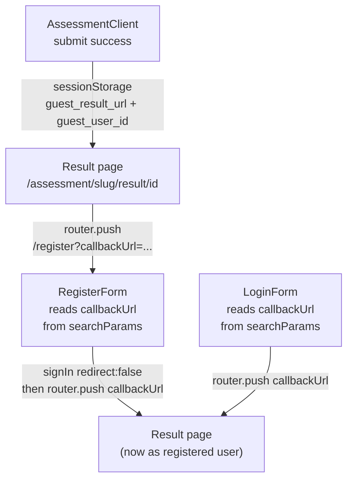

# Post-auth Redirect and Toast

## How the redirect chain works



Sonner toast fires just before `router.push`, giving ~1s of visible confirmation before the page transitions.

## Files to Change

### 1. Install sonner (shadcn)

Run `npx shadcn@latest add sonner`. Adds `src/components/ui/sonner.tsx`.

### 2. [`src/components/providers.tsx`](src/components/providers.tsx)

Add `<Toaster />` from `@/components/ui/sonner` inside `SessionProvider`.

### 3. [`src/app/(public)/assessment/[slug]/AssessmentClient.tsx`](<src/app/(public)/assessment/[slug]/AssessmentClient.tsx>)

On submit success, also store the full result URL in sessionStorage:

```typescript
sessionStorage.setItem('guest_user_id', result.userId);
sessionStorage.setItem(
  'guest_result_url',
  `/assessment/${assessment.slug}/result/${result.resultId}`,
);
```

### 4. [`src/app/(public)/assessment/[slug]/result/[resultId]/ResultClient.tsx`](<src/app/(public)/assessment/[slug]/result/[resultId]/ResultClient.tsx>)

The "Daftar Gratis" button currently does `router.push('/register')`. Change to pass the current path as `callbackUrl`:

```typescript
// Add at component top
const pathname = usePathname(); // from next/navigation

// Button onClick
router.push(`/register?callbackUrl=${encodeURIComponent(pathname)}`);
```

### 5. [`src/app/(auth)/register/RegisterForm.tsx`](<src/app/(auth)/register/RegisterForm.tsx>)

Three changes:

- **Read callbackUrl**: `useSearchParams()` → fallback to `sessionStorage.getItem('guest_result_url')` → fallback to `/`
- **Change `signIn` to `redirect: false`** (same pattern as LoginForm), then show toast, then `router.push(callbackUrl)` after 1s
- **Clear sessionStorage** `guest_result_url` after use

```typescript
// After successful register + signIn
toast.success('Akun berhasil dibuat!');
setTimeout(() => router.push(callbackUrl), 1000);
```

### 6. [`src/app/(auth)/login/LoginForm.tsx`](<src/app/(auth)/login/LoginForm.tsx>)

Add toast on success (already uses `redirect: false`):

```typescript
// Before router.push(callbackUrl)
toast.success('Berhasil login!');
setTimeout(() => router.push(callbackUrl), 1000);
```

## Key Constraints

- Google sign-in still uses NextAuth's built-in redirect (no toast possible before redirect) — no change there
- `callbackUrl` from searchParams takes priority over sessionStorage `guest_result_url` (user may have navigated directly)
- `guest_result_url` is cleared from sessionStorage after register completes (alongside the existing `guest_user_id` cleanup)

