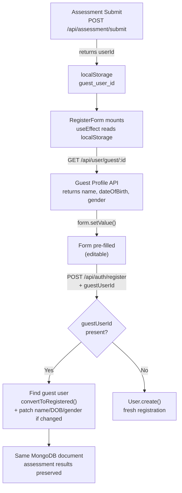

# Registration Form Enhancement

## Key Design Decision: Convert, Don't Create

The assessment submit API (`POST /api/assessment/submit`) already creates a guest user with `name`, `dateOfBirth`, and `gender`, returning `userId`. The User model already has a `convertToRegistered()` method. Rather than creating a second document, the register API will **convert the existing guest user in-place**, preserving their assessment results and history.

If no guest ID is present (user goes directly to register without taking the test), a fresh `User.create()` is used as fallback.

## Data Flow



## Files to Change

### 0. [`src/app/(public)/assessment/[slug]/AssessmentClient.tsx`](<src/app/(public)/assessment/[slug]/AssessmentClient.tsx>)

After a successful submission, `handleSubmit` currently drops `result.userId`. Add one line to persist it before navigating:

```typescript
// Before: router.push(`/assessment/${assessment.slug}/result/${result.resultId}`)
sessionStorage.setItem('guest_user_id', result.userId);
router.push(`/assessment/${assessment.slug}/result/${result.resultId}`);
```

> Note: the existing `sessionStorage.removeItem('guest_data')` runs before this — that's fine, `guest_user_id` is a separate key and stays until the user registers or closes the tab.

### 1. [`src/lib/db/models/User.ts`](src/lib/db/models/User.ts)

Remove `username` from the pre-save validation requirement. Username is auto-generated in the API layer (consistent with Google sign-in), so the model should not enforce it.

- In the `pre('save')` validation hook, remove the `if (!this.username)` throw

### 2. New: `src/app/api/user/guest/[id]/route.ts`

Minimal read-only endpoint for form pre-fill. Security guard: only returns data if `userType === 'guest'`.

```typescript
// GET /api/user/guest/[id]
// Returns { name, dateOfBirth, gender }
```

### 3. [`src/app/api/auth/register/route.ts`](src/app/api/auth/register/route.ts)

- Add `guestUserId` (optional string), `dateOfBirth` (optional date string), `gender` (optional `'male' | 'female'`) to the Zod schema
- Make `username` optional — auto-generate from `name` if blank
- **Convert-or-create branch**:
  - If `guestUserId` → find the guest user, call `convertToRegistered(email, password, username, 0)`, then patch `name`/`dateOfBirth`/`gender` if user edited them
  - If no `guestUserId` → `User.create()` as before

### 4. [`src/app/(auth)/register/RegisterForm.tsx`](<src/app/(auth)/register/RegisterForm.tsx>)

- **Schema**: Add `dateOfBirth` (optional), `gender` (optional `'male' | 'female'`), make `username` optional
- **Pre-fill**: `useEffect` reads `localStorage.getItem('guest_user_id')`, calls `GET /api/user/guest/:id`, populates fields via `form.setValue()`; stores the guest ID in component state to pass on submit
- **New fields**:
  - `dateOfBirth` — date picker using existing `Popover` + `Calendar` components
  - `gender` — `RadioGroup` using existing `radio-group.tsx` (Laki-laki / Perempuan)
  - `username` — optional, with hint label
- **Field order**: name → dateOfBirth → gender → email → username (optional) → password → confirmPassword
- On submit, include `guestUserId` in the request body

## Key Constraints

- `convertToRegistered()` currently only accepts `email, password, username, registerPoints` — after calling it, the API will additionally update `name`, `dateOfBirth`, `gender` on the document if the user changed them
- `gender` stays as `'male' | 'female'` — no Mongoose schema changes needed
- `dateOfBirth` and `gender` are already optional on the model — no migration needed
- Storage is `sessionStorage` (not `localStorage`) under the key `guest_user_id`, cleared on tab close
- The `guest_data` key (name/DOB/gender pre-test form) is already cleared by `AssessmentClient` after submit — `guest_user_id` is a separate key we add

